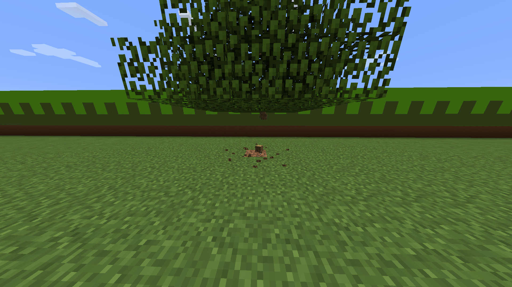

# TreeFellerPlus

## Fells, or chops down, trees automatically, similar to the Timber mod.

### Features:
* Automatically fells and chops down entire trees when the base of the tree is broken, no matter what the shape of the tree is (compatible with custom world generators)
* Uses an optimized depth-first search to find the exact outline of the tree
* Uses heuristics to prevent griefing
* Passes tree fellings to other plugins, such as WorldGuard, Factions, and Towny, to further prevent exploitation and griefing
* Detects and isolates each tree's leaves (enabled by default in the config) so that felling one tree will only break the leaves corresponding to that tree.
* Comes with a documented config.yml

### Permissions:
- treefellerplus.use: Allows one to automatically fell trees. All players have it by default.
- treefellerplus.reload: Allows one to execute /treefellerplus reload.

#### Notes:
Requires Java 7 or later.
